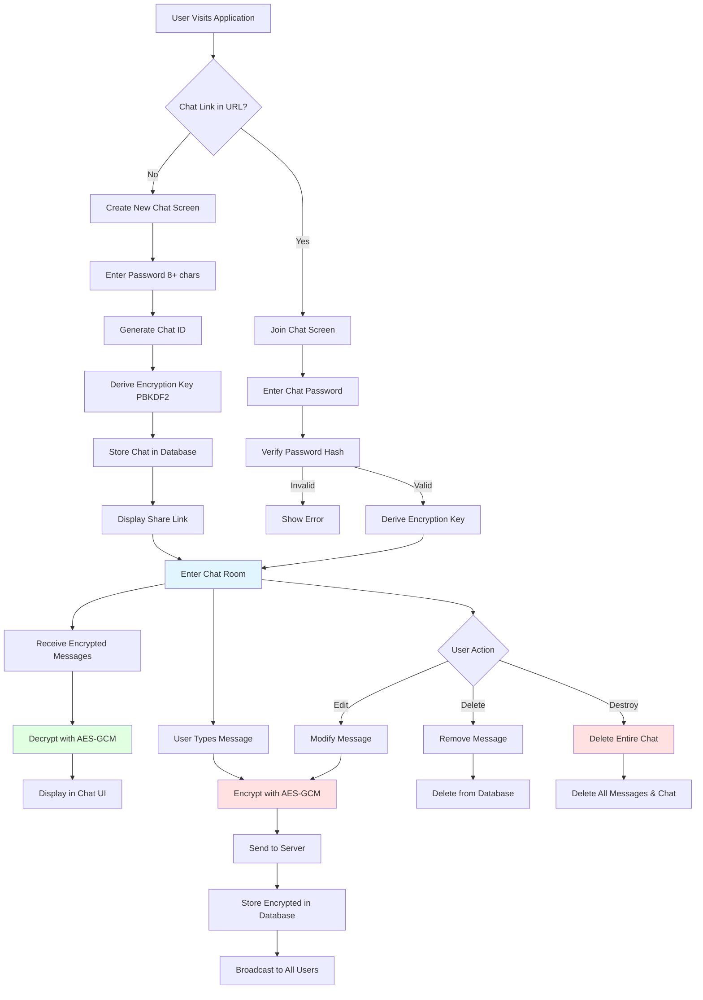
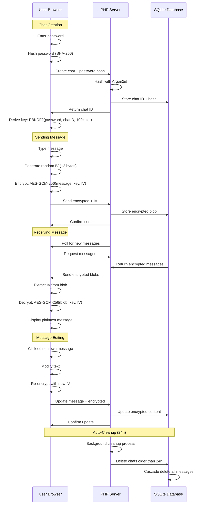

# 🔒 xsukax E2E Encrypted PHP Chat

A lightweight, self-hosted end-to-end encrypted chat application built with PHP and vanilla JavaScript. Zero dependencies, zero knowledge architecture, with automatic message destruction after 24 hours.

## 📋 Project Overview

xsukax E2E Encrypted PHP Chat is a privacy-focused, ephemeral messaging platform that enables secure real-time communication between multiple participants. The application implements client-side encryption ensuring that the server never has access to message content in plaintext. Built as a single-file PHP application with embedded HTML, CSS, and JavaScript, it requires minimal infrastructure while providing robust security guarantees.

The application creates temporary chat rooms that automatically expire after 24 hours, with all messages permanently deleted from the database. Each participant is assigned a randomly generated pseudonym, and all cryptographic operations occur in the browser using the Web Crypto API.

## 🛡️ Security and Privacy Benefits

### End-to-End Encryption
- **Client-Side Encryption**: All messages are encrypted in the browser using AES-GCM 256-bit encryption before transmission to the server
- **Zero-Knowledge Architecture**: The server stores only encrypted ciphertext and cannot decrypt messages under any circumstances
- **Password-Based Key Derivation**: Encryption keys are derived using PBKDF2 with 100,000 iterations and SHA-256 hashing
- **Unique Initialization Vectors**: Each message uses a cryptographically random 12-byte IV to prevent pattern analysis

### Privacy Protection
- **No Registration Required**: Users access chats anonymously without email addresses, phone numbers, or personal information
- **Pseudonymous Identity**: Each participant receives a randomly generated username (e.g., "SwiftPhoenix742") that persists only for the chat session
- **Automatic Data Destruction**: All chats and messages are permanently deleted from the database after 24 hours
- **Local-Only Identifiers**: User IDs and preferences are stored exclusively in browser localStorage and never transmitted to the server

### Database Security
- **Argon2id Password Hashing**: Chat passwords are hashed server-side using Argon2id (modern, memory-hard algorithm resistant to GPU attacks)
- **Prepared Statements**: All database queries use SQLite3 prepared statements to prevent SQL injection attacks
- **Minimal Data Retention**: Only chat ID, password hash, encrypted messages, timestamps, and edit flags are stored

### Transport Security
- **HTTPS Recommended**: While the application functions over HTTP, deployment behind HTTPS is strongly recommended to prevent man-in-the-middle attacks
- **No Third-Party Dependencies**: Eliminates supply chain vulnerabilities by using only browser-native APIs and PHP standard library

## ✨ Features and Advantages

### Core Functionality
- **Real-Time Messaging**: Messages appear instantly for all participants with 2-second polling interval
- **Multi-User Support**: Unlimited participants can join a single chat room with the chat ID and password
- **Message Editing**: Users can edit their own messages with edit history indicator
- **Message Deletion**: Users can delete their own messages at any time
- **Chat Destruction**: Any participant can permanently destroy the entire chat room for all users

### User Experience
- **Single-File Architecture**: Entire application contained in one `index.php` file for trivial deployment
- **Responsive Design**: Mobile-optimized interface with safe area support for notched devices
- **Minimal UI**: Clean, GitHub-inspired interface focused on usability
- **Browser Compatibility**: Works in all modern browsers supporting Web Crypto API (Chrome, Firefox, Safari, Edge)
- **No External Assets**: All CSS and JavaScript embedded; no CDN dependencies for core functionality

### Operational Benefits
- **Low Resource Requirements**: Runs on minimal PHP hosting with SQLite support
- **No External Database**: Uses SQLite file-based database (no MySQL/PostgreSQL required)
- **Automatic Cleanup**: Background process removes expired chats and messages
- **Share Links**: One-click generation of shareable chat URLs
- **Expiration Warnings**: Users notified when chat has less than 1 hour remaining

### Privacy Advantages
- **No Metadata Collection**: Server logs no IP addresses, user agents, or behavioral data
- **Ephemeral by Design**: 24-hour lifespan prevents long-term data accumulation
- **Self-Hosted Control**: You maintain complete control over data and infrastructure
- **Open Source Transparency**: Full source code available for security audit

## 🚀 Installation Instructions

### Prerequisites
- PHP 7.4 or higher (PHP 8.0+ recommended)
- SQLite3 PHP extension enabled
- Web server (Apache, Nginx, or PHP built-in server)
- HTTPS certificate (recommended for production)

### Installation Steps

1. **Clone the Repository**
   ```bash
   git clone https://github.com/xsukax/xsukax-E2E-Encrypted-PHP-Chat.git
   cd xsukax-E2E-Encrypted-PHP-Chat
   ```

2. **Verify PHP and SQLite3**
   ```bash
   php -v
   php -m | grep sqlite3
   ```
   If SQLite3 is not listed, install it:
   ```bash
   # Debian/Ubuntu
   sudo apt install php-sqlite3
   
   # CentOS/RHEL
   sudo yum install php-sqlite3
   
   # macOS (Homebrew)
   brew install php
   ```

3. **Set File Permissions**
   ```bash
   chmod 644 index.php
   # Ensure web server can write database file
   chmod 755 .
   ```

4. **Configure Web Server**

   **Apache** (`.htaccess` example):
   ```apache
   RewriteEngine On
   RewriteCond %{REQUEST_FILENAME} !-f
   RewriteRule ^.*$ index.php [L,QSA]
   ```

   **Nginx** (server block example):
   ```nginx
   location / {
       try_files $uri $uri/ /index.php?$query_string;
   }
   
   location ~ \.php$ {
       fastcgi_pass unix:/var/run/php/php8.1-fpm.sock;
       fastcgi_index index.php;
       include fastcgi_params;
   }
   ```

5. **Deploy to Web Server**
   - Upload `index.php` to your web server document root
   - Access via browser: `https://yourdomain.com/`

6. **Quick Test with PHP Built-in Server** (Development Only)
   ```bash
   php -S localhost:8000
   # Open browser to http://localhost:8000
   ```

### Docker Deployment (Optional)

Create a `Dockerfile`:
```dockerfile
FROM php:8.1-apache
RUN docker-php-ext-install pdo pdo_sqlite
COPY index.php /var/www/html/
RUN chown -R www-data:www-data /var/www/html
EXPOSE 80
```

Build and run:
```bash
docker build -t xsukax-chat .
docker run -d -p 8080:80 xsukax-chat
```

## 📖 Usage Guide

### Creating a New Chat

1. **Access the Application**
   - Navigate to your deployed application URL
   - The "Create New Chat" screen appears by default

2. **Set a Strong Password**
   - Enter a password of at least 8 characters
   - **Important**: This password is used for both:
     - Server-side chat authentication (Argon2id hashed)
     - Client-side message encryption (PBKDF2 key derivation)
   - Share this password securely with intended participants (use a separate secure channel)

3. **Create the Chat**
   - Click "Create Secure Chat"
   - A unique Chat ID is generated (e.g., `a3f9c8e2b1d4567890abcdef12345678`)
   - Copy the share link provided in the modal

4. **Share with Participants**
   - Send the share link to other participants via secure channels (Signal, encrypted email, etc.)
   - Share the password separately for defense-in-depth

### Joining an Existing Chat

1. **Open Share Link**
   - Click the link provided by the chat creator
   - The "Join Encrypted Chat" screen appears with Chat ID pre-filled

2. **Enter Password**
   - Input the chat password
   - Click "Unlock Chat"

3. **Start Messaging**
   - Your randomly generated username is displayed (e.g., "BraveWolf512")
   - Begin sending encrypted messages

### Sending and Managing Messages

- **Send Message**: Type in the input field and press Enter or click "Send"
- **Edit Message**: Click "✏️ Edit" on your own messages, modify text, and save
- **Delete Message**: Click "🗑️" on your own messages to permanently remove them
- **View Edit History**: Messages show "(edited)" indicator when modified

### Chat Management

- **Copy Share Link**: Click "📋 Share" in the header to copy the chat URL
- **Destroy Chat**: Click "💥 Destroy" to permanently delete the chat for all participants
  - ⚠️ Warning: This action is irreversible and affects all users

### Security Best Practices

1. **Use Strong Passwords**: Minimum 8 characters; recommend 16+ with mixed case, numbers, and symbols
2. **Share Passwords Securely**: Never send passwords in the same channel as chat links
3. **Verify Participants**: Confirm identity through out-of-band communication
4. **Use HTTPS**: Always access the application over HTTPS in production
5. **Time-Sensitive Communication**: Remember chats auto-delete after 24 hours
6. **Clear Browser Data**: Use incognito/private mode or clear localStorage after sensitive conversations

### Application Workflow



### Encryption Flow



## 📄 License

This project is licensed under the GNU General Public License v3.0.

---

## 🤝 Contributing

Contributions, issues, and feature requests are welcome! Feel free to check the [issues page](https://github.com/xsukax/xsukax-E2E-Encrypted-PHP-Chat/issues).

## ⚠️ Disclaimer

This software is provided "as is" without warranty of any kind. While implementing strong cryptographic practices, no system is 100% secure. Users should conduct their own security assessment before using this application for sensitive communications. The authors are not responsible for any data loss or security breaches.

## 📞 Support

For questions or support, please open an issue on GitHub.

---

**Built with 🔒 for privacy-conscious users**
