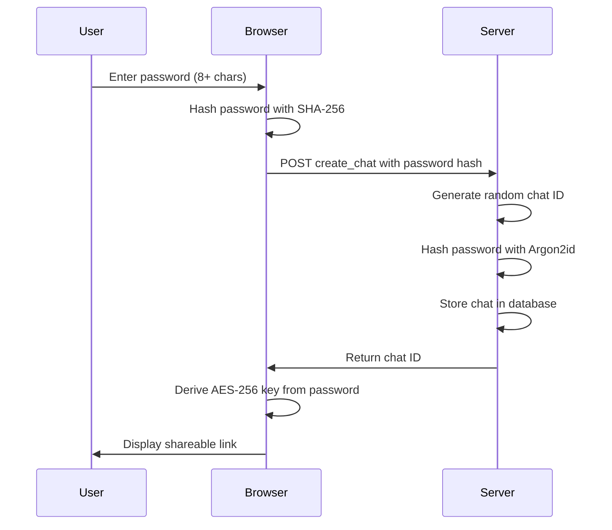
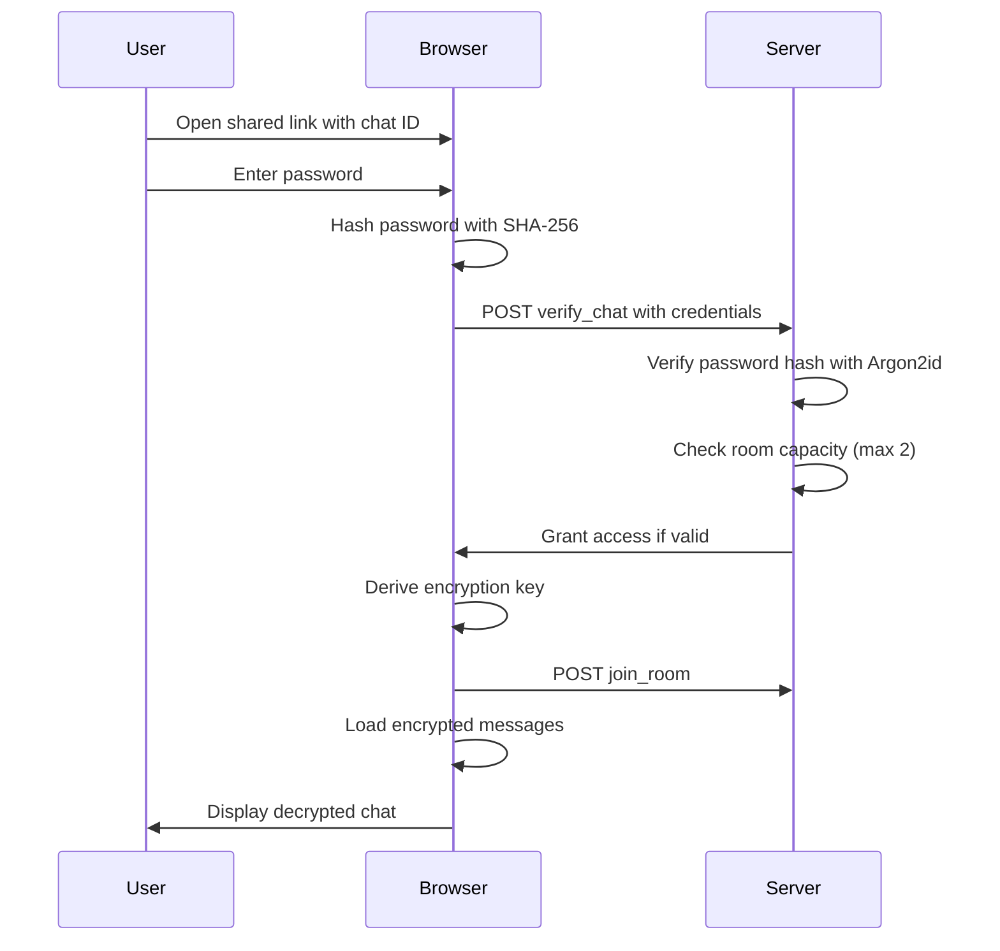
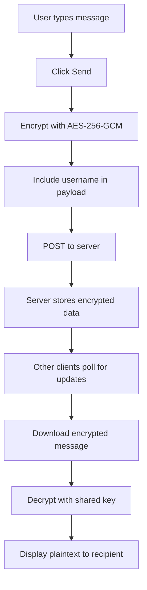
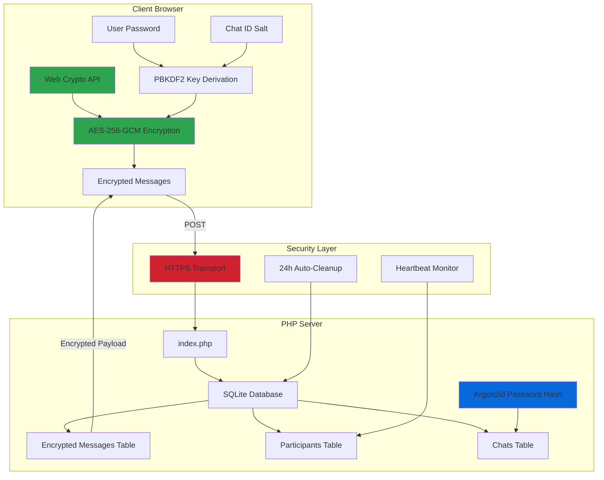

# 🔒 xsukax E2E Encrypted PHP Chat

A secure, self-hosted, end-to-end encrypted chat application built with PHP and vanilla JavaScript. This zero-knowledge chat system ensures that your conversations remain private, with messages encrypted client-side before transmission and automatic cleanup after 24 hours.

**Demo:** [https://xsukax.net/chat](https://xsukax.net/chat)

## Project Overview

xsukax E2E Encrypted PHP Chat is a lightweight, privacy-focused messaging application designed for secure, ephemeral conversations between two participants. Built as a single PHP file with no external dependencies, it provides enterprise-grade encryption while maintaining simplicity and ease of deployment.

The application implements true end-to-end encryption where the server never has access to decryption keys or plaintext messages. All cryptographic operations occur in the browser using the Web Crypto API, ensuring that even the server administrator cannot access conversation contents.

### Key Characteristics

- **Single-file deployment**: The entire application exists in one `index.php` file
- **Zero-knowledge architecture**: Server cannot decrypt messages or access conversation content
- **Ephemeral messaging**: All chats automatically expire and are permanently deleted after 24 hours
- **Two-participant rooms**: Designed for secure one-on-one conversations
- **SQLite backend**: Lightweight, serverless database with no configuration required
- **No external dependencies**: Pure PHP and vanilla JavaScript implementation

## Security and Privacy Benefits

### Client-Side Encryption

All encryption and decryption operations occur exclusively in the user's browser using the Web Crypto API. Messages are encrypted with AES-256-GCM before transmission, ensuring that plaintext content never traverses the network or reaches the server.

**Key Derivation**: The application uses PBKDF2 with 100,000 iterations and SHA-256 hashing to derive encryption keys from user passwords. The chat ID serves as a unique salt, ensuring that identical passwords generate different keys across different chat rooms.

### Zero-Knowledge Architecture

The server stores only encrypted content and has no mechanism to decrypt messages. Password verification uses Argon2id hashing on the server side, but the actual encryption key remains exclusively in client memory and is never transmitted.

**What the server knows:**
- Chat ID (a random identifier)
- Hashed passwords (for authentication, not encryption)
- Encrypted message payloads
- Message metadata (timestamps, user IDs)

**What the server cannot access:**
- Message plaintext
- Encryption keys
- Actual usernames (encrypted client-side)
- Any decryptable conversation content

### Automatic Data Destruction

All chat rooms and their associated messages are automatically purged from the database 24 hours after creation. This ephemeral design ensures that sensitive conversations have a limited lifetime and cannot be recovered after expiration.

### Session Isolation

Each chat generates a unique random identifier and maintains user-specific IDs stored in browser localStorage. Sessions are isolated, and inactive participants are automatically removed after 30 seconds of inactivity to prevent unauthorized access.

### Secure Communication Features

- **Message versioning**: Edit and delete operations are tracked with version numbers to prevent replay attacks
- **Participant verification**: Real-time heartbeat system ensures only active users remain in chat rooms
- **Room capacity limits**: Maximum of two participants prevents unauthorized joining
- **Password-protected rooms**: Each chat requires a password for access, with Argon2id hashing for verification

## Features and Advantages

### Core Capabilities

- ✅ **End-to-end encryption** using AES-256-GCM with Web Crypto API
- ✅ **Real-time messaging** with 2-second polling for instant message delivery
- ✅ **Message editing** with full encryption of edited content
- ✅ **Message deletion** with permanent removal from all clients
- ✅ **Custom nicknames** with encrypted storage and change notifications
- ✅ **Join/leave notifications** to track participant presence
- ✅ **Participant list** showing active users in real-time
- ✅ **Room sharing** via secure shareable links
- ✅ **Complete chat destruction** allowing permanent deletion before expiration
- ✅ **Responsive design** optimized for mobile and desktop devices
- ✅ **No registration required** - instant anonymous chat creation

### Technical Advantages

- **Lightweight footprint**: Single 68KB file with no external dependencies
- **Easy deployment**: Upload one PHP file to any web server
- **No configuration**: SQLite database created automatically
- **Framework-free**: Pure PHP and vanilla JavaScript
- **Standards-compliant**: Uses Web Crypto API and modern web standards
- **Cross-platform**: Works on any device with a modern browser
- **Self-hosted**: Full control over your data and infrastructure

### User Experience Benefits

- **Intuitive interface**: Clean, GitHub-inspired design with clear navigation
- **Random usernames**: Automatic generation of memorable pseudonyms
- **Expiration warnings**: Visual alerts when chat lifetime is running low
- **Copy-to-clipboard**: One-click sharing of secure chat links
- **Modal confirmations**: Protective warnings for destructive actions
- **Mobile-optimized**: Touch-friendly interface with safe area support

## Installation Instructions

### Prerequisites

- PHP 7.4 or higher with SQLite3 extension enabled
- Web server (Apache, Nginx, or any PHP-compatible server)
- HTTPS enabled (recommended for secure Web Crypto API usage)

### Installation Steps

1. **Download the application**
   ```bash
   wget https://raw.githubusercontent.com/xsukax/xsukax-E2E-Encrypted-PHP-Chat/main/index.php
   ```

2. **Upload to your web server**
   
   Place `index.php` in your web server's document root or any accessible directory:
   ```bash
   # Example for Apache
   cp index.php /var/www/html/chat/
   
   # Example for Nginx
   cp index.php /usr/share/nginx/html/chat/
   ```

3. **Set appropriate permissions**
   ```bash
   chmod 644 index.php
   chmod 755 /var/www/html/chat  # Directory must be writable for SQLite
   ```

4. **Verify PHP configuration**
   
   Ensure the SQLite3 extension is enabled in your `php.ini`:
   ```ini
   extension=sqlite3
   ```

5. **Access the application**
   
   Navigate to your installation URL in a web browser:
   ```
   https://yourdomain.com/chat/index.php
   ```

### Server Configuration (Optional)

For cleaner URLs, configure URL rewriting:

**Apache (.htaccess)**
```apache
RewriteEngine On
RewriteCond %{REQUEST_FILENAME} !-f
RewriteRule ^(.*)$ index.php [QSA,L]
```

**Nginx**
```nginx
location /chat {
    try_files $uri $uri/ /chat/index.php?$query_string;
}
```

### Security Recommendations

1. **Enable HTTPS**: Web Crypto API requires secure contexts
2. **Set appropriate file permissions**: Prevent unauthorized modifications
3. **Configure PHP security**:
   ```ini
   expose_php = Off
   display_errors = Off
   log_errors = On
   ```
4. **Implement rate limiting**: Prevent abuse at the web server level
5. **Regular backups**: Although chats expire, backup the SQLite database periodically

## Usage Guide

### Creating a New Chat



**Steps:**
1. Navigate to the application URL
2. Enter a strong password (minimum 8 characters)
3. Click "Create Secure Chat"
4. Share the generated link and password with your intended recipient
5. Wait for the other participant to join

### Joining an Existing Chat



**Steps:**
1. Receive the chat link and password from the creator
2. Open the link in your browser
3. Enter the shared password
4. Click "Unlock Chat"
5. Start messaging securely

### Sending Encrypted Messages



**Process:**
1. Type your message in the input field
2. Press Enter or click "Send"
3. Message encrypts automatically in your browser
4. Encrypted payload transmits to server
5. Other participant's browser fetches and decrypts the message
6. Message appears in their chat interface

### Message Management

**Editing Messages:**
1. Click the "✏️ Edit" button on your own message
2. Modify the text in the modal dialog
3. Click "Save" to encrypt and update the message
4. The updated message synchronizes to all participants with an "(edited)" indicator

**Deleting Messages:**
1. Click the "🗑️" button on your own message
2. Confirm the deletion in the modal
3. Message is marked as deleted and displays as "[Message deleted]"
4. Deletion synchronizes to all participants immediately

**Changing Nickname:**
1. Click your displayed username in the chat header
2. Enter a new nickname (1-20 characters)
3. Click "Save" to update and notify other participants
4. System message announces the name change

### Chat Room Management

**Viewing Participants:**
- Click the "👥 Users" button to see active participants
- Online status indicated by green dots
- Your username marked with "(you)"

**Sharing the Chat:**
- Click "📋 Share" to copy the invitation link
- Manually share the password through a separate secure channel
- Maximum of 2 participants can join any chat room

**Destroying a Chat:**
- Click "💥 Destroy" in the chat header
- Confirm the irreversible action
- All messages and metadata permanently deleted from the database
- All participants immediately disconnected

### System Architecture



### Best Practices

1. **Use Strong Passwords**: Minimum 12 characters with mixed case, numbers, and symbols
2. **Share Passwords Securely**: Never send passwords through the same channel as chat links
3. **Verify Participants**: Check the participant list before sharing sensitive information
4. **Mind the Expiration**: Chats automatically delete after 24 hours
5. **Destroy When Done**: Manually destroy chats containing sensitive information after use
6. **Keep Browser Updated**: Ensure Web Crypto API support and security patches
7. **Use HTTPS**: Always access the application over encrypted connections

## Technical Specifications

### Encryption Details

- **Algorithm**: AES-256-GCM (Galois/Counter Mode)
- **Key Derivation**: PBKDF2 with 100,000 iterations, SHA-256
- **Initialization Vector**: 12 bytes of cryptographically secure random data per message
- **Password Hashing**: Argon2id (server-side authentication only)

### Database Schema

**chats table**
- `id`: TEXT PRIMARY KEY (random 32-character hex string)
- `password_hash`: TEXT (Argon2id hash for authentication)
- `created_at`: INTEGER (Unix timestamp)

**messages table**
- `id`: INTEGER PRIMARY KEY AUTOINCREMENT
- `chat_id`: TEXT (foreign key to chats)
- `user_id`: TEXT (client-generated UUID)
- `encrypted_content`: TEXT (AES-256-GCM encrypted payload)
- `timestamp`: INTEGER (Unix timestamp)
- `edited`: INTEGER (boolean flag)
- `deleted`: INTEGER (boolean flag)
- `version`: INTEGER (optimistic locking counter)
- `msg_type`: TEXT (message, join, leave, rename)

**participants table**
- `id`: INTEGER PRIMARY KEY AUTOINCREMENT
- `chat_id`: TEXT (foreign key to chats)
- `user_id`: TEXT (client-generated UUID)
- `encrypted_name`: TEXT (encrypted username)
- `last_seen`: INTEGER (Unix timestamp for heartbeat)

### Browser Compatibility

- Chrome/Edge 37+
- Firefox 34+
- Safari 11+
- Opera 24+
- Modern mobile browsers with Web Crypto API support

## Troubleshooting

### Common Issues

**"Chat not found" error**
- Verify the chat ID in the URL is correct
- Check if the chat has expired (24-hour lifetime)
- Ensure the server database is accessible

**"Invalid password" error**
- Confirm you're using the exact password (case-sensitive)
- Check for extra spaces or characters
- Request a new link from the chat creator

**"Room is full" error**
- Only 2 participants can join simultaneously
- Wait for someone to leave or create a new chat

**Messages not appearing**
- Check your internet connection
- Verify JavaScript is enabled
- Clear browser cache and reload

**Decryption failures**
- Ensure you're using the correct password
- Check if the encryption key matches (try re-entering password)
- Verify browser Web Crypto API support

## Contributing

Contributions are welcome! Please feel free to submit issues, fork the repository, and create pull requests for bug fixes or feature enhancements.

### Development Setup

1. Fork the repository
2. Clone your fork locally
3. Set up a local PHP development environment
4. Make your changes
5. Test thoroughly (encryption, message sync, edge cases)
6. Submit a pull request with detailed description

### Code Style

- Follow PSR-12 coding standards for PHP
- Use consistent JavaScript formatting (2-space indentation)
- Comment complex cryptographic operations
- Maintain the single-file architecture

## License

This project is licensed under the GNU General Public License v3.0.

## Acknowledgments

Built with security and privacy as the foremost priorities, leveraging modern web standards and cryptographic best practices to provide a trustworthy communication platform.

---

**Security Notice**: While this application implements strong encryption, no system is perfectly secure. Always assess your threat model and use appropriate security measures for your specific use case. For highly sensitive communications, consider additional operational security practices.
